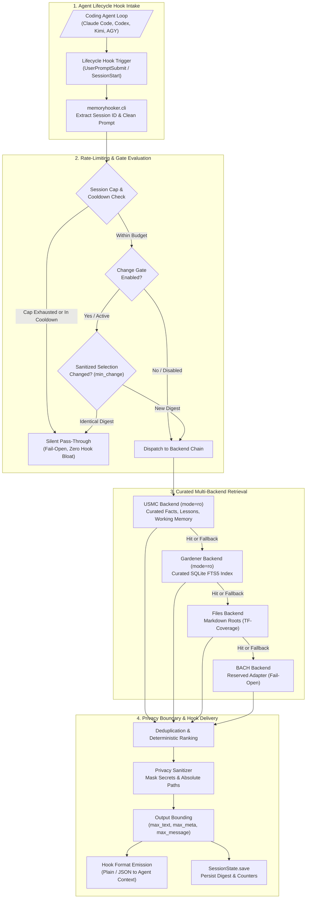
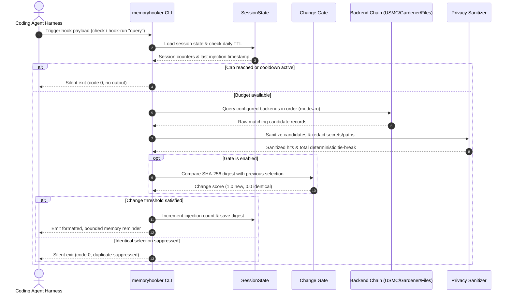

# MemoryHooker

[](https://github.com/ellmos-ai/memoryhooker/actions/workflows/ci.yml)
[](pyproject.toml)
[](pyproject.toml)
[](pyproject.toml)
[](LICENSE)
[](#sec-12)
[](#sec-12)
[](NOTICE)
[](THIRD_PARTY_LICENSES.txt)
[](SECURITY.md)
[](SECURITY.md)
[](SECURITY.md)
[](https://github.com/astral-sh/ruff)
[](https://github.com/ellmos-ai)
[](https://github.com/open-bricks)
[](llms.txt)
[](THIRD_PARTY_LICENSES.md)
[](MARKETING-LOG.txt)

[English](README.md) | [Deutsch](README_de.md)

> [!NOTE]
> **AI & Agent Indexing:** This repository provides an [`llms.txt`](llms.txt) machine-readable summary for AI agents, LLM tools, and lifecycle hooks.
> **Contributing:** Development happens in the private twin `memoryhooker-provenance`; this repository carries the curated open-source distribution. See [CONTRIBUTING.md](CONTRIBUTING.md).

MemoryHooker connects local memory sources (Markdown directories, SQLite FTS5 full-text databases, and USMC curated tables) to lifecycle hooks exposed by coding agents. It can emit an unobtrusive reminder to check memory, provide a concise clue, or perform a local search and inject selected, sanitized hits directly into the prompt stream. The package operates under strict privacy and resilience invariants: it makes zero network requests, accesses external databases in read-only mode, masks sensitive tokens, enforces strict output bounds, and never modifies host configuration automatically.

---

<a id="sec-00"></a><a id="quick-navigation"></a><a id="schnellnavigation"></a>
## Quick Navigation

- [✨ Highlights & Philosophy](#highlights--philosophy)
- [🏗️ System Architecture & Visual Topology](#system-architecture--visual-topology)
- [🔄 End-to-End Lifecycle Sequence](#end-to-end-lifecycle-sequence)
- [🎯 Target Personas & Discoverability](#target-personas--discoverability)
- [⚖️ Comparative Matrix vs Alternatives](#comparative-matrix-vs-alternatives)
- [🧠 Memory Backends & Ranking](#memory-backends--ranking)
- [🛡️ Governance & Runtime Invariants](#governance--runtime-invariants)
- [🎛️ Modes & Configuration](#modes--configuration)
- [🔌 Supported Providers & Snippets](#supported-providers--snippets)
- [🔒 Privacy, Redaction & Change Gates](#privacy-redaction--change-gates)
- [💻 Command Line & Diagnostics](#command-line--diagnostics)
- [🧪 Verification & Test Suite](#verification--test-suite)
- [🌐 Sibling Ecosystem & Partner Matrix](#sibling-ecosystem--partner-matrix)
- [📄 Third-Party Licenses & Level 1 SBOM](#third-party-licenses--level-1-sbom)
- [🔐 Security Policy & 48h SLA](#security-policy--48h-sla)
- [📖 Machine-Readable Context & llms.txt](#machine-readable-context--llmstxt)
- [🏛️ Author, Attribution & Canonical Notice](#author-attribution--canonical-notice)
- [📜 Statutory Disclaimer (§ 521 BGB) & License](#statutory-disclaimer--521-bgb--license)

---

<a id="sec-01"></a><a id="highlights--philosophy"></a><a id="highlights--philosophie"></a>
## Highlights & Philosophy

- 🧠 **Multi-Tier Local Memory**: Queries curated USMC tables (`usmc_facts`, `usmc_lessons`, `usmc_working`), Gardener SQLite FTS5 databases, or local Markdown document hierarchies with configurable fallback chains.
- 🛡️ **100% Zero-Egress Core**: Built entirely on the Python standard library with zero external runtime dependencies, zero HTTP/TCP sockets, and unprivileged user-mode execution (`RunAsInvoker`).
- 🔒 **Deterministic Privacy Boundary**: Automatically redacts API keys, bearer tokens, passwords, and absolute host filesystem paths (`[redacted]`) before emitting hook outputs.
- 🎛️ **Intelligent Rate Limiting & Cooldown**: Protects agent turns from context pollution through configurable injection limits per session (`max_injections_per_session`), cooldown intervals, and automatic calendar-day state TTL resets.
- 🚪 **Optional SHA-256 Change Gate**: Evaluates candidate selection digests against previous emissions; silences identical hits (`min_change = 1.0`) while persisting only hashes—never raw prompts or hits.
- 🔍 **Read-Only Probe Diagnostics**: Dedicated `diagnose` command analyzes config health, rate limits, and backend hit scores without mutating state or consuming session quotas.
- 🤝 **Broad Coding Agent Ecosystem**: Out-of-the-box snippet generators for Claude Code, Codex CLI, Kimi Code CLI, Antigravity, Git, and manual execution pipelines.

---

<a id="sec-02"></a><a id="system-architecture--visual-topology"></a><a id="systemarchitektur--visuelle-topologie"></a>
## System Architecture & Visual Topology

### Four-View Architectural Topology Projection

```text
+-------------------------------------------------------------------------------+
|  VIEW 1: CALLER RUNTIMES, LIFECYCLE HOOKS & AGENT CLIENTS                     |
|  - Coding Agent Loops (Claude Code, Codex CLI, Kimi Code, Antigravity)        |
|  - Lifecycle Hook Triggers (UserPromptSubmit, SessionStart, PreToolUse)       |
|  - Developer Terminal CLI (memoryhooker check / diagnose / clear / providers) |
|  - Automated CI/CD Quality Gates & Multi-OS Test Runners                      |
+---------------------------------------+---------------------------------------+
                                        | triggers hook payload / query
                                        v
+-------------------------------------------------------------------------------+
|  VIEW 2: MEMORYHOOKER SOVEREIGN CORE ENGINE & PIPELINE ORCHESTRATOR           |
|  - Mode Selector (remember, clue, remember+search, trigger injector)          |
|  - Ingress Guardrails (session budget caps, cooldown, calendar-day TTL)       |
|  - Cryptographic Change Gate (SHA-256 digest suppression, min_change = 1.0)   |
|  - Multi-Backend Dispatcher (USMC, Gardener SQLite FTS5, Files, BACH)        |
+---------------------------------------+---------------------------------------+
                                        | queries / ranks & filters
                                        v
+-------------------------------------------------------------------------------+
|  VIEW 3: RUNTIME PERSISTENCE, SHARED MEMORY SCHEMAS & AUDIT LEDGER            |
|  - USMC Curated Tables (mode=ro: usmc_facts, usmc_lessons, usmc_working)      |
|  - Gardener FTS5 Full-Text Index (mode=ro: distilled lessons, transcript cut) |
|  - Local Markdown Document Roots (normalized TF-coverage saturation)          |
|  - Shared Trigger Invariants (context_triggers: rule groups & prefixes)       |
+---------------------------------------+---------------------------------------+
                                        | sanitizes / bounds & emits
                                        v
+-------------------------------------------------------------------------------+
|  VIEW 4: AIR-GAP DEFENSE PERIMETER, RUNASINVOKER & ZERO-EGRESS GOVERNANCE     |
|  - 100% Local-First Offline Operation & Zero Network Sockets (INV-LOCAL-01)   |
|  - Unprivileged Non-Elevation Security Policy (INV-UNPRIV-03, RunAsInvoker)  |
|  - Deterministic Privacy Sanitizer (INV-REDACT-04: masks tokens & paths)      |
|  - Fail-Open Fault Tolerance (INV-FAILOPEN-08) & Output Ceilings (INV-BOUND-05)|
|  - Level 1 SBOM Transparency & Statutory Disclaimer (§ 521 BGB) & 48h SLA    |
+-------------------------------------------------------------------------------+
```

### System Architecture Flow


```mermaid
flowchart TD
    subgraph INTAKE ["1. Agent Lifecycle Hook Intake"]
        AG[/"Coding Agent Loop<br/>(Claude Code, Codex, Kimi, AGY)"/] --> EVT["Lifecycle Hook Trigger<br/>(UserPromptSubmit / SessionStart)"]
        EVT --> EXTR["memoryhooker.cli<br/>Extract Session ID & Clean Prompt"]
    end

    subgraph GATING ["2. Rate-Limiting & Gate Evaluation"]
        EXTR --> SESS{"Session Cap &<br/>Cooldown Check"}
        SESS -->|Cap Exhausted or In Cooldown| SILENT["Silent Pass-Through<br/>(Fail-Open, Zero Hook Bloat)"]
        SESS -->|Within Budget| GATE{"Change Gate<br/>Enabled?"}
        GATE -->|No / Disabled| RETR["Dispatch to Backend Chain"]
        GATE -->|Yes / Active| CHK{"Sanitized Selection<br/>Changed? (min_change)"}
        CHK -->|Identical Digest| SILENT
        CHK -->|New Digest| RETR
    end

    subgraph RETRIEVAL ["3. Curated Multi-Backend Retrieval"]
        RETR --> B1["USMC Backend (mode=ro)<br/>Curated Facts, Lessons, Working Memory"]
        B1 -->|Hit or Fallback| B2["Gardener Backend (mode=ro)<br/>Curated SQLite FTS5 Index"]
        B2 -->|Hit or Fallback| B3["Files Backend<br/>Markdown Roots (TF-Coverage)"]
        B3 -->|Hit or Fallback| B4["BACH Backend<br/>Reserved Adapter (Fail-Open)"]
    end

    subgraph SANITIZE ["4. Privacy Boundary & Hook Delivery"]
        B1 & B2 & B3 & B4 --> DEDUP["Deduplication & Deterministic Ranking"]
        DEDUP --> REDACT["Privacy Sanitizer<br/>Mask Secrets & Absolute Paths"]
        REDACT --> BOUND["Output Bounding<br/>(max_text, max_meta, max_message)"]
        BOUND --> INJECT["Hook Format Emission<br/>(Plain / JSON to Agent Context)"]
        BOUND --> STATE["SessionState.save<br/>Persist Digest & Counters"]
    end
```

---

<a id="sec-03"></a><a id="end-to-end-lifecycle-sequence"></a><a id="end-to-end-lebenszyklus-sequenz"></a>
## End-to-End Lifecycle Sequence


```mermaid
sequenceDiagram
    autonumber
    actor Agent as Coding Agent Harness
    participant CLI as memoryhooker CLI
    participant State as SessionState
    participant Gate as Change Gate
    participant Chain as Backend Chain (USMC/Gardener/Files)
    participant Privacy as Privacy Sanitizer

    Agent->>CLI: Trigger hook payload (check / hook-run "query")
    CLI->>State: Load session state & check daily TTL
    State-->>CLI: Session counters & last injection timestamp
    alt Cap reached or cooldown active
        CLI-->>Agent: Silent exit (code 0, no output)
    else Budget available
        CLI->>Chain: Query configured backends in order (mode=ro)
        Chain-->>CLI: Raw matching candidate records
        CLI->>Privacy: Sanitize candidates & redact secrets/paths
        Privacy-->>CLI: Sanitized hits & total deterministic tie-break
        opt Gate is enabled
            CLI->>Gate: Compare SHA-256 digest with previous selection
            Gate-->>CLI: Change score (1.0 new, 0.0 identical)
        end
        alt Change threshold satisfied
            CLI->>State: Increment injection count & save digest
            CLI-->>Agent: Emit formatted, bounded memory reminder
        else Identical selection suppressed
            CLI-->>Agent: Silent exit (code 0, duplicate suppressed)
        end
    end
```

---

<a id="sec-04"></a><a id="target-personas--discoverability"></a><a id="zielgruppen--auffindbarkeit"></a>
## Target Personas & Discoverability

| Persona | Core Profile & Tech Stack | Architectural Friction & Pain Point | How `memoryhooker` Solves It |
|:---|:---|:---|:---|
| **[PERSONA-01] Autonomous AI Coding Agents & Harness Engineers** | Building agent harnesses (Claude Code, Codex CLI, Kimi Code, Antigravity, custom loops). | Blind prompt execution without historical project lessons; context window stuffing causes latency and excessive inference token consumption. | Lifecycle hooks fire tailored memories (`remember`, `clue`, `remember+search`) with strict output bounds and fail-open resilience. |
| **[PERSONA-02] Local-First & Zero-Egress System Architects** | Managing secure, on-premise, or air-gapped developer environments. | Cloud vector databases (Pinecone, Qdrant Cloud) leak proprietary code fragments, require credentials, and add network failure modes. | 100% Zero-Egress core standard library, zero external sockets, local SQLite `mode=ro` queries, and unprivileged operation (`RunAsInvoker`). |
| **[PERSONA-03] Multi-Agent Swarm Orchestrators & Context Engineers** | Designing collaborative multi-agent architectures (BACH, USMC, Swarms). | Competing write operations corrupt state; noisy historical transcripts drown out curated lessons and architecture guidelines. | Read-only adapters for curated USMC/Gardener databases, transcript noise filtering, and deterministic multi-source deduplication. |
| **[PERSONA-04] Compliance, Security & Enterprise DevOps Officers** | Regulating enterprise AI security boundaries and preventing data leakage. | Prompts and logs inadvertently expose secret API keys, internal paths, or unconstrained state growth across developer machines. | Deterministic regex redaction of secrets/tokens and paths, strict output caps, daily state TTL resets, and transparent audit logs. |

**High-Intent Discovery Keywords & Topic Tags:** `coding-agent-memory-hook`, `local-first-memory-retrieval`, `llm-agent-hook-reminders`, `claude-code-memory-integration`, `codex-hook-memory`, `zero-egress-ai-memory`, `sqlite-fts5-agent-memory`, `deterministic-context-injection`, `privacy-safe-llm-hook`, `usmc-memory-backend`.

---

<a id="sec-05"></a><a id="comparative-matrix-vs-alternatives"></a><a id="vergleichsmatrix-gegenüber-alternativen"></a>
## Comparative Matrix vs Alternatives

| Architectural Criterion | Invariant Reference | `memoryhooker` | Ad-hoc Scripts | Cloud Vector DB RAG | Chat History Buffer | MemGPT / Letta |
|:---|:---|:---|:---|:---|:---|:---|
| **License & Open Source** | Open Source | **MIT (100% Free)** | Unlicensed | Commercial SaaS | Built-in / None | Apache 2.0 / SaaS |
| **Network Egress & Privacy** | `INV-LOCAL-01` | **100% Zero-Egress (0 Sockets)** | Variable | Cloud Vector DB RAG | Local Memory | Remote Server / Cloud |
| **Storage Mutability** | `INV-READONLY-02` | **Strictly Read-Only (`mode=ro`)** | Uncontrolled | Managed Cloud | Ephemeral Prompt | Read/Write SQLite |
| **Security & Privilege** | `INV-UNPRIV-03` | **Unprivileged (`RunAsInvoker`)** | Uncontrolled | API Token Exposure | Unisolated | Server / Daemon |
| **Deterministic Redaction** | `INV-REDACT-04` | **Yes (Tokens/Paths -> `[redacted]`)**| None | None | None | None |
| **Output Length Ceilings** | `INV-BOUND-05` | **Configurable Hard Ceilings** | None | Raw Payload | Context Cap | Complex Pagination |
| **Deterministic Change Gate** | `INV-GATE-06` | **Yes (SHA-256 Suppression)** | None | None | None | LLM Self-Managed |
| **Session Cap & Rate Limit** | `INV-SPAM-07` | **Yes (Caps, Cooldown, Daily TTL)**| None | Cost Limits | Window Cutoff | Daemon Rate Limit |
| **Fault Tolerance & Safety** | `INV-FAILOPEN-08` | **Fail-Open (Never Crashes Turn)** | Fatal Errors | Network Failures | Context Loss | Daemon Crashes |
| **Binding Security SLA** | `INV-SLA-10` | **Binding 48h Response SLA** | None | Commercial Tier | None | Community Best Effort |

---

<a id="sec-06"></a><a id="memory-backends--ranking"></a><a id="speicher-backends--ranking"></a>
## Memory Backends & Ranking

MemoryHooker connects to multiple retrieval backends configured in `memoryhooker.toml`:

### 1. USMC Backend (`usmc`)
The `usmc` backend reads [USMC](https://pypi.org/project/usmc/)'s three curated tables directly in read-only mode: `usmc_facts`, `usmc_lessons`, and `usmc_working`. It never imports the `usmc` package directly (avoiding automatic database schema creation on missing paths). Ranking balances distinct query term coverage with USMC curation severity (e.g. `critical` lessons outrank `low` lessons at identical term matches).

### 2. Gardener Backend (`gardener`)
Queries local SQLite databases populated with FTS5 full-text indexes. To avoid context bloat, the adapter automatically filters out uncurated raw session transcripts (such as observed chat histories), focusing exclusively on distilled memories and lessons.

### 3. Files Backend (`files`)
Scans configured Markdown directories and individual file paths. Uses a normalized ranking formula combining query term coverage (60%) and bounded term frequency saturation (40%) within `(0, 1]`, with multi-root deduplication.

### 4. BACH Backend (`bach`)
A reserved adapter for upcoming BACH ecosystem integration. Currently fails open safely and returns no hits without database access.

---

<a id="sec-07"></a><a id="governance--runtime-invariants"></a><a id="governance---laufzeit-invarianten"></a>
## Governance & Runtime Invariants

| Invariant ID | Name / Protection | Enforcement Level & Mechanism | Architectural Guarantee & Failure Mode |
|:---|:---|:---|:---|
| `INV-LOCAL-01` | **100% Local-First & Zero-Egress** | Architectural / Zero Network Sockets | The core engine imports zero networking libraries and performs no HTTP/TCP/UDP operations. Memory lookups never leave the local machine. |
| `INV-READONLY-02` | **Read-Only External Storage** | Database Connection Contract (`mode=ro`) | External SQLite databases (Gardener, USMC) are opened strictly in read-only mode; MemoryHooker never creates schemas or mutates third-party data. |
| `INV-UNPRIV-03` | **Unprivileged User-Mode (RunAsInvoker)** | Process Security Model | Runs entirely under standard user credentials without requesting Administrator or root elevation, ensuring least privilege. |
| `INV-REDACT-04` | **Deterministic Secret & Path Redaction** | Regex Sanitizer (`memoryhooker.policy`) | Automatically redacts common API keys, passwords, bearer tokens, and absolute local filesystem paths with `[redacted]` before hook emission. |
| `INV-BOUND-05` | **Strict Field & Message Bounding** | Output Boundary Enforcement | Enforces configurable hard ceilings on text length, source paths, metadata fields, and total hook message characters (`max_message_chars`). |
| `INV-GATE-06` | **Deterministic Change Gate** | Cryptographic Digest Comparison | Computes SHA-256 digest of sanitized selections; silences identical repeated hits (`min_change = 1.0`) while persisting only hashes—never raw hits. |
| `INV-SPAM-07` | **Session Rate Limiting & Daily TTL** | SessionState Controller | Enforces `max_injections_per_session` and `cooldown_seconds`. Session state resets automatically across calendar days (`state_date`). |
| `INV-FAILOPEN-08` | **Fail-Open Hook Fault Tolerance** | Exception Isolation Boundaries | Missing configurations, unavailable backends, or corrupt state files exit cleanly with status code 0 and empty output, never crashing agent turns. |
| `INV-LLM-09` | **Bilingual Parity & LLM Indexing** | Documentation Architecture | Full 18-point anchor parity between English (`README.md`) and German (`README_de.md`), paired with structured [`llms.txt`](llms.txt). |
| `INV-SLA-10` | **48-Hour Response & 5-Day Triage SLA** | Security Policy (`SECURITY.md`) | Dedicated security channels (`security@ellmos.ai`, `security@open-bricks.org`) committed to 48-hour response and 5-business-day triage SLA. |

---

<a id="sec-08"></a><a id="modes--configuration"></a><a id="betriebsmodi--konfiguration"></a>
## Modes & Configuration

Create `memoryhooker.toml` in your project root or user home:

```toml
[mode]
active = "remember+search"
search_after_n_searches = 3
max_hits = 3
min_rank = 0.5
max_injections_per_session = 5
cooldown_seconds = 60

[gate]
# Explicit opt-in. When false (default), standard mode behavior applies.
enabled = false
min_relevance = 0.5
# 1.0 silences an identical sanitized selection compared to last emission.
min_change = 1.0

[output]
max_text_chars = 500
max_source_chars = 160
max_meta_chars = 160
max_meta_entries = 32
max_meta_total_chars = 1000
max_message_chars = 2000
redaction_marker = "[redacted]"
truncation_marker = "…[truncated]"

[backend]
order = ["usmc", "gardener", "files"]

[backend.usmc]
db_path = "~/.usmc/usmc_memory.db"

[backend.gardener]
db_path = "~/.gardener/gardener.db"
user_db_path = "~/.gardener/user.db"

[backend.files]
path = "./memory"

[providers]
order = ["claude", "codex", "kimi", "agy", "git", "manual"]
```

### Operational Modes
- **`remember`**: Lightweight reminder nudging the agent to search memory when turn thresholds are exceeded.
- **`clue`**: Emits a targeted, concise clue when prompt keywords match configured triggers.
- **`remember+search`**: Executes local retrieval across backends and formats top-ranked sanitized hits directly into the hook output.

### Trigger Injector (optional, off by default)
Independent of the active mode, `[triggers]` emits curated keyword hints stored in the shared `context_triggers` table (`memory_union` contract, read by the `usmc` backend and by BACH's in-process backend). Each source yields at most one hint per prompt (first matching row by `id`) and has its own cooldown; `trigger_phrase` may list alternatives separated by `|`.

```toml
[triggers]
sources = ["strategy"]   # context_triggers.source values; empty = off
agent_id = "default"     # rows of this agent plus 'default'
once_per_session = []    # e.g. ["theme"]: a rule of these sources fires once per session
[triggers.cooldowns]
strategy = 120           # seconds; default 60
[triggers.groups]        # optional: one injector key over several table sources
context = ["manual", "theme", "workflow"]   # one hint per prompt, first match by id
[triggers.prefixes]
context = "[KONTEXT] "
```

---

<a id="sec-09"></a><a id="supported-providers--snippets"></a><a id="unterstützte-provider--snippets"></a>
## Supported Providers & Snippets

MemoryHooker generates configuration fragments tailored for host agent lifecycle hooks:

```shell
# Inspect available providers
python -m memoryhooker providers

# Generate configuration snippet for specific coding agent
python -m memoryhooker install-snippet --provider claude
python -m memoryhooker install-snippet --provider codex
python -m memoryhooker install-snippet --provider kimi
python -m memoryhooker install-snippet --provider agy
```

> [!IMPORTANT]
> `install-snippet` prints the exact hook configuration fragment to stdout. In accordance with `INV-UNPRIV-03` and safety principles, it never mutates host configuration files automatically. Review and merge the snippet manually into your agent settings.

---

<a id="sec-10"></a><a id="privacy-redaction--change-gates"></a><a id="datenschutz-redigierung--änderungs-gatter"></a>
## Privacy, Redaction & Change Gates

MemoryHooker treats prompt content and retrieved records with defensive data isolation:

1. **Deterministic Redaction**: Before any hook output is emitted, strings pass through regex filters that replace credentials (API keys, passwords, bearer tokens) and absolute host filesystem paths with `[redacted]`.
2. **Deterministic Tie-Breaking**: Equal-ranked hits are sorted by source key and text hash, ensuring absolute reproducibility across execution runs.
3. **Cryptographic Change Gate (`[gate]`)**: When enabled, computes a SHA-256 digest over the sanitized candidate set. If the digest matches the previous emission in the session state, the hook stays silent, preventing duplicate prompt reminders.

---

<a id="sec-11"></a><a id="command-line--diagnostics"></a><a id="kommandozeile--diagnose"></a>
## Command Line & Diagnostics

```shell
# Standard hook check
python -m memoryhooker --config memoryhooker.toml check "deployment checklist"

# Read-only probe diagnostics (evaluates config, gates, and hit ranks without mutating state)
python -m memoryhooker --config memoryhooker.toml diagnose "deployment checklist"

# Reset session injection budget
python -m memoryhooker clear
```

### Troubleshooting: The Silent Hook
By design, `check` and `hook-run` exit silently with code 0 when no relevant hits are found or when limits apply—a hook must never masquerade as an agent error. If your hook remains silent unexpectedly:
- Ensure `--config`, `--session-id`, and `--state-dir` are passed as **top-level** arguments before the subcommand (e.g. `memoryhooker --config x.toml check "..."`).
- Run `diagnose` with the identical prompt and flags to inspect whether configuration loading, rate limiting, or backend availability caused the silence.

---

<a id="sec-12"></a><a id="verification--test-suite"></a><a id="verifikation--test-suite"></a>
## Verification & Test Suite

```powershell
# Run full automated test suite
python -m pytest

# Run code style & static analysis
python -m ruff check .

# Verify bytecode compilation
python -m compileall -q memoryhooker tests
```

Over 213 automated unit, integration, behavioral, and contract tests validate incremental retrieval, FTS5 queries, USMC table curation, deterministic redaction, session rate limiting, and manifest parity with 100% green status.

---

<a id="sec-13"></a><a id="sibling-ecosystem--partner-matrix"></a><a id="geschwister-ökosystem--partnermatrix"></a>
## Sibling Ecosystem & Partner Matrix

MemoryHooker is a core component of the `ellmos-ai` ecosystem under the `open-bricks` open-source umbrella:

| Component / Layer | Module / Tool | Role in Ecosystem |
|:---|:---|:---|
| **Memory & Curated Knowledge** | `usmc` | Universal Semantic Memory Core (curated facts, lessons, working memory) |
| **Indexing & Observation** | `gardener` | Incremental file indexing, memory consolidation, and SQLite text search |
| **Lifecycle Hooks & Orchestration** | `workflowhooker` | Declarative workflow hooks and orchestration triggers for agent pipelines |
| **Core & Foundation Protocols** | `ellmos-core` | Core capability descriptors, module contracts, and foundational abstractions |
| **Multi-Agent State Preservation** | `clutch`, `coma` | Agent state preservation, execution snapshots, and context compaction |
| **Scheduling & Execution** | `ellmos-scheduler` | Local-first cron, interval, and authority-leased background job runner |
| **Control & Governance** | `ellmos-controlcenter-mcp` | Capability routing, stack discovery, and ecosystem tool mediation |
| **Code Intelligence** | `ellmos-codecommander-mcp` | Structural code manipulation, import diagnostics, and AST analysis |
| **Filesystem Triage** | `ellmos-filecommander-mcp` | Safe filesystem operations, checksumming, and file management |
| **File Automation** | `file-collect-sort-action` | Configuration-driven folder scanning, deduplication, and stepped actions |
| **Workflow Automation** | `n8n-manager-mcp` | Workflow lifecycle automation, safety governance, and API integration |
| **Lock Governance** | `lock-master` | Central lock management, conflict avoidance, and multi-agent coordination |
| **Incident & Ticket Tracking** | `ticket-master` | Local-first issue triage, ticket lifecycle management, and receipts |
| **Agent Bootstrap** | `safe-start-for-codex` | Deterministic local runtime initialization, permission gating, lock checks |
| **Desktop Workspaces** | `DevCenter`, `CodeBox` | Interactive developer workspaces, pipeline monitoring, and UI surfaces |
| **Umbrella Ecosystem** | `open-bricks` | Open-source standard libraries, toolkits, and desktop applications |

---

<a id="sec-14"></a><a id="third-party-licenses--level-1-sbom"></a><a id="drittanbieter-lizenzen--level-1-sbom"></a>
## Third-Party Licenses & Level 1 SBOM

MemoryHooker maintains an audited inventory of runtime components and developer tooling in [`THIRD_PARTY_LICENSES.md`](THIRD_PARTY_LICENSES.md) (plain-text companion: [`THIRD_PARTY_LICENSES.txt`](THIRD_PARTY_LICENSES.txt)) and canonical attribution in [`NOTICE`](NOTICE). All runtime code relies on permissive components (MIT and PSFL-2.0), with development dependencies under MIT and Apache-2.0. There are **zero copyleft dependencies**. Target personas, search keywords, and competitive analysis are tracked in [`MARKETING-LOG.txt`](MARKETING-LOG.txt).

---

<a id="sec-15"></a><a id="security-policy--48h-sla"></a><a id="sicherheitsrichtlinie--48h-sla"></a>
## Security Policy & 48h SLA

MemoryHooker maintains a strict vulnerability disclosure policy in [`SECURITY.md`](SECURITY.md). We commit to a **48-hour response SLA** and a **5-business-day triage window** for confidential security disclosures submitted through GitHub Security Advisories or to `security@ellmos.ai` and `security@open-bricks.org`.

---

<a id="sec-16"></a><a id="machine-readable-context--llmstxt"></a><a id="maschinenlesbarer-kontext--llmstxt"></a>
## Machine-Readable Context & llms.txt

This repository provides a machine-readable context file at [`llms.txt`](llms.txt) adhering to standard agent indexing specifications. It exposes core repository invariants, provider endpoints, and file maps designed for direct consumption by autonomous agents and LLM harnesses.

---

<a id="sec-17"></a><a id="author-attribution--canonical-notice"></a><a id="autor-attribution--kanonische-notice"></a>
## Author, Attribution & Canonical Notice

MemoryHooker is authored and maintained by **Lukas Geiger** and contributors as part of the **ellmos-ai** organization under the **open-bricks** open-source initiative. Detailed provenance statements, architectural lineage, and canonical copyright claims are formalized in [`NOTICE`](NOTICE) and [`PROVENANCE.md`](PROVENANCE.md).

---

<a id="sec-18"></a><a id="statutory-disclaimer--521-bgb--license"></a><a id="gesetzlicher-haftungsausschluss--521-bgb--lizenz"></a>
## Statutory Disclaimer (§ 521 BGB) & License

This software is provided free of charge under the terms of the [MIT License](LICENSE). Under German statutory provisions governing gratuitous contracts and services (§ 521 BGB Gefälligkeitsrecht), liability for defects in quality and legal title is restricted to instances of fraudulent concealment (*Arglist*) or intent (*Vorsatz*). The software is distributed on an "AS IS" BASIS, WITHOUT WARRANTIES OR CONDITIONS OF ANY KIND, either express or implied.
