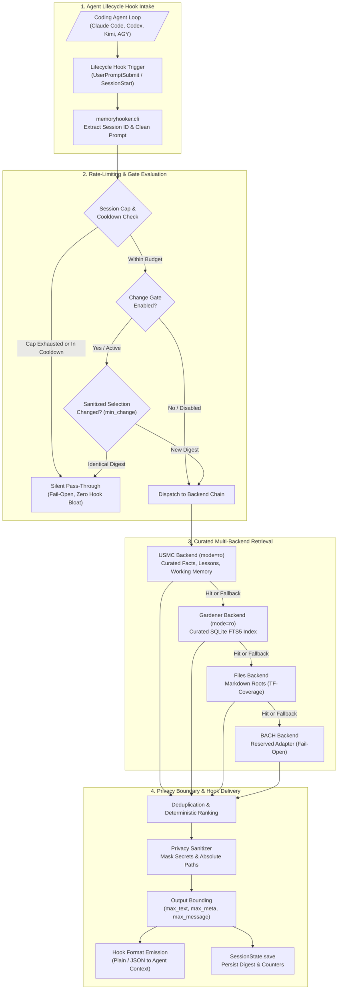
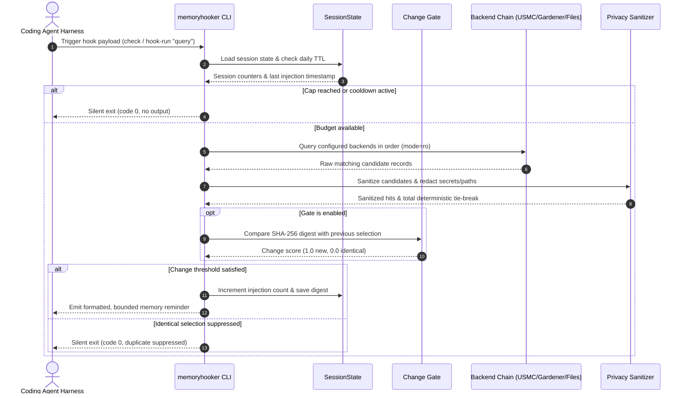

# MemoryHooker

[](https://github.com/ellmos-ai/memoryhooker/actions/workflows/ci.yml)
[](pyproject.toml)
[](pyproject.toml)
[](pyproject.toml)
[](LICENSE)
[](#verifikation--tests)
[](#verifikation--tests)
[](SECURITY.md)
[](SECURITY.md)
[](SECURITY.md)
[](https://github.com/astral-sh/ruff)
[](https://github.com/ellmos-ai)
[](https://github.com/open-bricks)
[](llms.txt)
[](THIRD_PARTY_LICENSES.md)
[](MARKETING-LOG.txt)

[English](README.md) | [Deutsch](README_de.md)

> [!NOTE]
> **KI- & Agenten-Indexierung:** Dieses Repository bietet eine maschinenlesbare [`llms.txt`](llms.txt)-Zusammenfassung für KI-Agenten, LLM-Werkzeuge und Lifecycle-Hooks.
> **Beitragen:** Die Entwicklung findet im privaten Twin `memoryhooker-provenance` statt; dieses Repository trägt die kuratierte Open-Source-Distribution. Siehe [CONTRIBUTING.md](CONTRIBUTING.md).

MemoryHooker verbindet lokale Wissensquellen (Markdown-Verzeichnisse, SQLite-FTS5-Volltextdatenbanken und USMC-kuratierte Tabellen) mit den Lebenszyklus-Hooks von Coding-Agenten. Das Paket kann eine dezente Erinnerung an die Gedächtnissuche ausgeben, einen kurzen thematischen Hinweis liefern oder eine lokale Suche durchführen und ausgewählte, bereinigte Treffer direkt in den Prompt-Stream injizieren. Die Architektur operiert unter strikten Sicherheits- und Resilienz-Invarianten: sie erfordert kein Netzwerk, greift rein lesend auf externe Datenbanken zu, maskiert sensible Token, begrenzt die Ausgabelänge deterministisch und verändert niemals selbstständig die Host-Konfiguration.

---

## Schnellnavigation

- [✨ Highlights & Philosophie](#highlights--philosophie)
- [🎯 Zielgruppen & Auffindbarkeit](#zielgruppen--auffindbarkeit)
- [⚖️ Vergleichsmatrix gegenüber Alternativen](#vergleichsmatrix-gegenüber-alternativen)
- [🏗️ Systemarchitektur-Ablauf](#systemarchitektur-ablauf)
- [🔄 End-to-End Lebenszyklus-Sequenz](#end-to-end-lebenszyklus-sequenz)
- [🛡️ Governance- & Laufzeit-Invarianten](#governance---laufzeit-invarianten)
- [🔌 Unterstützte Provider & Snippets](#unterstützte-provider--snippets)
- [🧠 Speicher-Backends & Ranking](#speicher-backends--ranking)
- [🎛️ Betriebsmodi & Konfiguration](#betriebsmodi--konfiguration)
- [🔒 Datenschutz, Redigierung & Gatter](#datenschutz-redigierung--gatter)
- [💻 Kommandozeile & Diagnose](#kommandozeile--diagnose)
- [🧪 Verifikation & Tests](#verifikation--tests)
- [🌐 Geschwister-Ökosystem & Partnermodule](#geschwister-ökosystem--partnermodule)
- [📄 Drittanbieter-Lizenzen & Transparenz](#drittanbieter-lizenzen--transparenz)
- [🔐 Sicherheitsrichtlinie & SLA](#sicherheitsrichtlinie--sla)
- [📜 Lizenz & Herkunft](#lizenz--herkunft)

---

## Highlights & Philosophie

- 🧠 **Mehrstufiges lokales Gedächtnis**: Fragt kuratierte USMC-Tabellen (`usmc_facts`, `usmc_lessons`, `usmc_working`), Gardener-SQLite-FTS5-Datenbanken oder lokale Markdown-Dateibäume mit konfigurierbaren Fallback-Ketten ab.
- 🛡️ **100% Zero-Egress Core**: Vollständig auf der Python-Standardbibliothek aufgebaut, ohne externe Runtime-Abhängigkeiten, ohne HTTP/TCP-Sockets und im unprivilegierten Anwendermodus (`RunAsInvoker`).
- 🔒 **Deterministische Datenschutzgrenze**: Redigiert API-Schlüssel, Bearer-Token, Passwörter und absolute Host-Dateipfade automatisch zu `[redacted]`, bevor Hook-Ausgaben emittiert werden.
- 🎛️ **Intelligente Ratenbegrenzung & Cooldown**: Schützt Agenten-Kontexte vor Flutung durch Begrenzung je Sitzung (`max_injections_per_session`), Cooldown-Intervalle und automatischen Tages-TTL-Reset.
- 🚪 **Optionales SHA-256 Change-Gate**: Berechnet Prüfsummen über bereinigte Trefferauswahlen; schaltet identische Wiederholungen stumm (`min_change = 1.0`), während nur Hashes persistiert werden—niemals Rohtreffer.
- 🔍 **Read-Only Diagnose-Sonde**: Dediziertes `diagnose`-Kommando analysiert Konfigurationsstatus, Ratenbegrenzung und Treffergüte ohne State-Mutation oder Budget-Verbrauch.
- 🤝 **Breite Coding-Agent-Unterstützung**: Vorkonfigurierte Snippet-Generatoren für Claude Code, Codex CLI, Kimi Code CLI, Antigravity, Git und manuelle Aufrufe.

---

## Zielgruppen & Auffindbarkeit

| Persona | Profil & Tech-Stack | Reibungspunkt & Herausforderung | Lösung durch `memoryhooker` |
|:---|:---|:---|:---|
| **Autonome Coding-Agenten & Harness-Entwickler** | Entwicklung von Agenten-Harnesses (Claude Code, Codex CLI, Kimi Code, Antigravity, eigene Loops). | Blinde Prompt-Ausführung ohne historische Erkenntnisse; Context-Stuffing sprengt das Token-Budget und verlangsamt die Inferenz. | Lifecycle-Hooks liefern präzise Erinnerungen (`remember`, `clue`, `remember+search`) mit strikten Längenlimits und Fail-Open-Sicherheit. |
| **Local-First & Zero-Egress Architekten** | Betrieb sicherer On-Premise-, Unternehmens- oder Air-Gapped-Entwicklungsumgebungen. | Cloud-Vektordatenbanken (Pinecone, Qdrant Cloud) leiten geschützten Code ins Web ab, benötigen Zugangsdaten und erzeugen Netzausfälle. | 100% Offline-Standardbibliothek, null Netzwerksockets, lokale SQLite-Abfragen in `mode=ro` und unprivilegierter Betrieb (`RunAsInvoker`). |
| **Multi-Agent Swarm Orchestratoren & Kontext-Ingenieure** | Entwurf kollaborativer Multi-Agenten-Systeme (BACH, USMC, Multi-Agent Swarms). | Parallele Schreibzugriffe beschädigen Datenbanken; veraltete Sitzungstranskripte überdecken kuratierte Architektur-Leitlinien. | Strikte Read-Only-Adapter für USMC und Gardener, Transkript-Filterung und sprachneutrale Multi-Quellen-Deduplizierung. |
| **Compliance, Security & Enterprise DevOps Officers** | Überwachung betrieblicher KI-Sicherheitsgrenzen und Schutz vor Datenabfluss. | Prompts oder Logs leaken versehentlich API-Schlüssel, interne Pfade oder erzeugen unbegrenzten Speicher-Wildwuchs. | Deterministische Regex-Redigierung von Zugangsdaten und Pfaden, strikte Längengrenzen, tägliche State-TTLs und transparente Audits. |

**High-Intent Suchbegriffe & Topic-Tags:** `coding agent gedächtnis hook`, `lokaler speicher llm agenten python`, `zero egress ki gedächtnis`, `claude code hook speicher integration`, `deterministische kontext injektion ki`, `datenschutz llm hook redigierung`, `agent lifecycle hook retrieval`, `sqlite fts5 volltextsuche agent speicher`.

---

## Vergleichsmatrix gegenüber Alternativen

| Kriterium | `memoryhooker` | Ad-hoc Python / Shell Skripte | Cloud Vector DB RAG | Chat History Buffer | MemGPT / Letta |
|:---|:---|:---|:---|:---|:---|
| **Lizenz & Open Source** | **MIT (100% frei & Open Source)** | Meist unlizenziert / Ad-hoc | Kommerzielles SaaS | Integriert / Keine | Apache 2.0 / SaaS |
| **Netzwerk-Egress & Datenschutz** | **100% Zero-Egress (0 Sockets)** | Variabel / Unbestimmt | Daten verlassen Host | Lokaler Prompt | Server / Cloud-API |
| **Latenz & Prozess-Overhead** | **<50ms (In-Process / CLI)** | 50–500ms | 100–1000ms+ (Netzwerk) | 0ms (im Prompt) | 200–2000ms (Daemon) |
| **Sicherheit & Berechtigung** | **Unprivilegiert (`RunAsInvoker`)** | Oft unkontrolliert | API-Token Risiken | Keine Isolation | Server / Docker Deamons |
| **Agenten-Hook-Integration** | **Native Snippets (Claude/Codex/Kimi/AGY)** | Manuelle Frickellösung | Reine API-Anbindung | Nur im Chatfenster | Eigener SDK-Wrapper |
| **Kuratierte Speicherquellen** | **USMC, Gardener FTS5, Files** | Rohe Textdateien | Vektor-Embeddings | Rohe Chathistorie | Eigene Datenbank |
| **Deterministische Redigierung** | **Ja (Secrets & Pfade -> `[redacted]`)** | Keine | Keine | Keine | Keine |
| **Ausgabe- & Sitzungslimits** | **Ja (Limits, Cooldown, Tages-TTL)** | Keine (Spam-Gefahr) | Reine Kostenlimits | Token-Kontextgrenze | Komplexes Management |
| **Deterministisches Change-Gate** | **Ja (SHA-256 Digest-Filterung)** | Keine | Keine | Keine | LLM-Selbstverwaltet |
| **Maschinenlesbare LLM-Parität** | **Ja (`llms.txt` + Bilinguale READMEs)** | Keine | Web-Dokumentation | Keine | Web-Dokumentation |

---

## Systemarchitektur-Ablauf



---

## End-to-End Lebenszyklus-Sequenz



---

## Governance- & Laufzeit-Invarianten

| Invarianten-ID | Name / Schutzbereich | Durchsetzungs-Mechanismus | Architektur-Garantie & Ausfallverhalten |
|:---|:---|:---|:---|
| `INV-LOCAL-01` | **100% Local-First & Zero-Egress** | Architektur / Keine Netzwerksockets | Der Kern importiert keine Netzwerkbibliotheken und führt keine HTTP/TCP/UDP-Aufrufe aus. Speicherabfragen bleiben 100% auf dem lokalen Rechner. |
| `INV-READONLY-02` | **Reiner Lesezugriff auf Speicher** | Datenbank-Verbindungsvertrag (`mode=ro`) | Externe SQLite-Datenbanken (Gardener, USMC) werden strikt lesend geöffnet; MemoryHooker legt niemals Schemas an und modifiziert keine fremden Daten. |
| `INV-UNPRIV-03` | **Unprivilegierter Modus (RunAsInvoker)** | Prozess-Sicherheitsmodell | Läuft vollständig unter Standard-Benutzerrechten ohne Administrator- oder Root-Elevation für strikte Least-Privilege-Sicherheit. |
| `INV-REDACT-04` | **Deterministische Secret-Redigierung** | Regex-Sanitizer (`memoryhooker.policy`) | Maskiert gängige API-Schlüssel, Passwörter, Bearer-Token und absolute lokale Dateipfade automatisch mit `[redacted]` vor der Ausgabe. |
| `INV-BOUND-05` | **Strikte Längen- & Feldgrenzen** | Ausgabegrenzen-Durchsetzung | Erzwingt konfigurierbare Höchstgrenzen für Textlänge, Quellenpfade, Metadatenfelder und Gesamtlänge der Hook-Nachricht (`max_message_chars`). |
| `INV-GATE-06` | **Deterministisches Change-Gate** | Kryptographischer Digest-Abgleich | Erzeugt SHA-256 Prüfsummen über bereinigte Treffer; unterdrückt identische Wiederholungen (`min_change = 1.0`), speichert nur Hashes—keine Rohtreffer. |
| `INV-SPAM-07` | **Sitzungs-Ratenlimit & Tages-TTL** | SessionState-Controller | Erzwingt `max_injections_per_session` und `cooldown_seconds`. Der Sitzungsstatus setzt sich über Kalendertage automatisch zurück (`state_date`). |
| `INV-FAILOPEN-08` | **Fail-Open Hook-Fehlertoleranz** | Ausnahme-Isolationsgrenzen | Fehlende Konfigurationen, nicht erreichbare Backends oder defekte State-Dateien beenden sauber mit Statuscode 0 und stummer Ausgabe. |
| `INV-LLM-09` | **Bilinguale Parität & LLM-Indexierung** | Dokumentationsarchitektur | Vollständige 16-Punkte-Anker-Parität zwischen englischer (`README.md`) und deutscher (`README_de.md`) Version, ergänzt durch [`llms.txt`](llms.txt). |
| `INV-SLA-10` | **48-Stunden Antwort & 5-Tage Triage SLA** | Sicherheitsrichtlinie (`SECURITY.md`) | Dedizierte Sicherheitskanäle (`security@ellmos.ai`, `security@open-bricks.org`) mit Verpflichtung zu 48h Reaktionszeit und 5 Werktagen Triage. |

---

## Unterstützte Provider & Snippets

MemoryHooker generiert gebrauchsfertige Konfigurationsfragmente für Coding-Agenten:

```shell
# Verfügbare Provider anzeigen
python -m memoryhooker providers

# Konfigurations-Snippet für spezifischen Agenten erzeugen
python -m memoryhooker install-snippet --provider claude
python -m memoryhooker install-snippet --provider codex
python -m memoryhooker install-snippet --provider kimi
python -m memoryhooker install-snippet --provider agy
```

> [!IMPORTANT]
> `install-snippet` gibt das Konfigurationsfragment auf stdout aus. Gemäß `INV-UNPRIV-03` und dem Sicherheitsmodell verändert das Tool Host-Konfigurationen niemals automatisch. Überprüfe das Snippet und trage es manuell in deine Agentenkonfiguration ein.

---

## Speicher-Backends & Ranking

MemoryHooker unterstützt mehrere in `memoryhooker.toml` konfigurierbare Abfrage-Backends:

### 1. USMC-Backend (`usmc`)
Liest [USMCs](https://pypi.org/project/usmc/) drei kuratierte Tabellen direkt im Read-Only-Modus aus: `usmc_facts`, `usmc_lessons` und `usmc_working`. Das Backend importiert das `usmc`-Paket bewusst nicht direkt (um eine automatische Schemagenerierung auf noch nicht existierenden Pfaden zu verhindern). Das Ranking kombiniert Treffer-Abdeckung mit Kuratierungsstufen (z. B. schlagen `critical`-Lektionen gleichrangige `low`-Einträge).

### 2. Gardener-Backend (`gardener`)
Fragt lokale SQLite-FTS5-Volltextindizes ab. Um Kontextüberflutung zu vermeiden, filtert der Adapter unkuratierte Roh-Transkripte vergangener Chatsitzungen automatisch heraus und priorisiert destillierte Regeln und Erkenntnisse.

### 3. Datei-Backend (`files`)
Durchsucht konfigurierte Markdown-Verzeichnisse und einzelne Dateipfade. Verwendet ein normalisiertes Ranking aus Suchbegriffsabdeckung (60%) und gesättigter Begriffshäufigkeit (40%) in `(0, 1]`, inklusive Multi-Root-Deduplizierung.

### 4. BACH-Backend (`bach`)
Reservierter Adapter für die künftige BACH-Ökosystemintegration. Beendet derzeit fail-open ohne Datenbankzugriff und ohne Treffer.

---

## Betriebsmodi & Konfiguration

Beispiel für `memoryhooker.toml` im Projekt- oder Benutzerverzeichnis:

```toml
[mode]
active = "remember+search"
search_after_n_searches = 3
max_hits = 3
min_rank = 0.5
max_injections_per_session = 5
cooldown_seconds = 60

[gate]
# Explizites Opt-In. Bei false (Standard) bleibt das bisherige Modusverhalten aktiv.
enabled = false
min_relevance = 0.5
# 1.0 schaltet eine identische bereinigte Auswahl gegenüber der letzten Ausgabe stumm.
min_change = 1.0

[output]
max_text_chars = 500
max_source_chars = 160
max_meta_chars = 160
max_meta_entries = 32
max_meta_total_chars = 1000
max_message_chars = 2000
redaction_marker = "[redacted]"
truncation_marker = "…[truncated]"

[backend]
order = ["usmc", "gardener", "files"]

[backend.usmc]
db_path = "~/.usmc/usmc_memory.db"

[backend.gardener]
db_path = "~/.gardener/gardener.db"
user_db_path = "~/.gardener/user.db"

[backend.files]
path = "./memory"

[providers]
order = ["claude", "codex", "kimi", "agy", "git", "manual"]
```

### Betriebsmodi
- **`remember`**: Schlanke Erinnerung, die den Agenten nach Erreichen von Schwellenwerten an die Gedächtnissuche erinnert.
- **`clue`**: Gibt einen kurzen, zielgerichteten Hinweis aus, wenn Prompt-Schlüsselwörter mit Auslösern übereinstimmen.
- **`remember+search`**: Führt die lokale Suche über die Backend-Kette durch und formatiert die bestplatzierten Treffer direkt in die Hook-Ausgabe.

---

## Datenschutz, Redigierung & Gatter

MemoryHooker behandelt Eingaben und Suchergebnisse mit strikter Datenisolation:

1. **Deterministische Redigierung**: Vor jeder Ausgabe filtern reguläre Ausdrücke Anmeldedaten (API-Keys, Passwörter, Bearer-Token) und absolute lokale Dateipfade heraus und ersetzen sie durch `[redacted]`.
2. **Deterministisches Tie-Breaking**: Gleichrangige Treffer werden anhand von Quellenschlüssel und Texthash stabil sortiert, was reproduzierbare Ausgaben garantiert.
3. **Kryptographisches Change-Gate (`[gate]`)**: Berechnet einen SHA-256-Digest über die bereinigte Trefferauswahl. Stimmt der Hash mit der vorherigen Ausgabe der Sitzung überein, bleibt der Hook stumm, um doppelte Hinweise zu vermeiden.

---

## Kommandozeile & Diagnose

```shell
# Standard Hook-Prüfung
python -m memoryhooker --config memoryhooker.toml check "deployment checklist"

# Read-Only Sondendiagnose (prüft Config, Gatter und Treffer ohne State-Mutation)
python -m memoryhooker --config memoryhooker.toml diagnose "deployment checklist"

# Sitzungs-Budget manuell zurücksetzen
python -m memoryhooker clear
```

### Fehlerbehebung: Ein stummer Hook
`check` und `hook-run` geben bei fehlenden Treffern oder erreichten Limits absichtlich keine Ausgabe aus (Code 0), da ein Hook niemals als Fehler wahrgenommen werden darf. Wenn der Hook unerwartet stumm bleibt:
- Stelle sicher, dass `--config`, `--session-id` und `--state-dir` als **Top-Level-Argumente** vor dem Subcommand stehen (z. B. `memoryhooker --config x.toml check "..."`).
- Führe `diagnose` mit demselben Prompt und Flags aus, um aufzuschlüsseln, ob Konfigurationspfade, Sitzungs-Caps oder Backend-Verfügbarkeit ursächlich sind.

---

## Verifikation & Tests

```powershell
# Vollständige automatisierte Testsuite ausführen
python -m pytest

# Code-Stil und statische Analyse prüfen
python -m ruff check .

# Bytecode-Kompilierung verifizieren
python -m compileall -q memoryhooker tests
```

Über 180 automatisierte Unit-, Integrations- und Vertragstests decken inkrementelle Suche, FTS5-Abfragen, USMC-Tabellenabfragen, deterministische Redigierung, Sitzungs-Ratenbegrenzungen und Manifest-Parität ab.

---

## Geschwister-Ökosystem & Partnermodule

MemoryHooker ist Teil des `ellmos-ai`-Ökosystems unter dem Open-Source-Dach von `open-bricks`:

| Komponente / Schicht | Modul / Werkzeug | Rolle im Ökosystem |
|:---|:---|:---|
| **Gedächtnis & Kuratierung** | `usmc` | Universal Semantic Memory Core (kuratierte Fakten, Lektionen, Arbeitsgedächtnis) |
| **Indexierung & Beobachtung** | `gardener` | Inkrementelle Dateiindexierung, Gedächtniskonsolidierung und SQLite-Textsuche |
| **Lebenszyklus-Hooks & Workflow** | `workflowhooker` | Deklarative Workflow-Hooks und Orchestrierungs-Trigger für Agenten |
| **Kern- & Basiskontrakte** | `ellmos-core` | Basis-Fähigkeitsbeschreibungen, Modulverträge und Protokolle |
| **Zustandssicherung** | `clutch`, `coma` | Multi-Agenten-Zustandssicherung, Ausführungs-Snapshots und Kontext-Kompaktierung |
| **Planung & Hintergrundjobs** | `ellmos-scheduler` | Lokale Cron-, Intervall- und autoritätsgesteuerte Hintergrundjobs |
| **Steuerung & Governance** | `ellmos-controlcenter-mcp` | Fähigkeits-Routing, Stack-Inspektion und Werkzeug-Vermittlung |
| **Code-Intelligenz** | `ellmos-codecommander-mcp` | Strukturelle Code-Manipulation, Import-Diagnose und AST-Analysen |
| **Dateisystem & Triage** | `ellmos-filecommander-mcp` | Sichere Dateiverwaltung, Prüfsummen und Dateioperationen |
| **Datei-Automatisierung** | `file-collect-sort-action` | Konfigurationsgesteuerte Ordnersortierung, Duplikaterkennung und Aktionen |
| **Workflow-Automatisierung** | `n8n-manager-mcp` | Lifecycle-Automatisierung von Workflows, Governance und API-Anbindung |
| **Lock-Governance** | `lock-master` | Zentrales Sperrmanagement, Konfliktvermeidung und Koordination |
| **Ticket- & Vorfallverwaltung** | `ticket-master` | Lokale Fehlertriage, Ticket-Lebenszyklus und Quittungen |
| **Agenten-Bootstrap** | `safe-start-for-codex` | Deterministische Initialisierung, Rechtemodell und Lock-Prüfungen |
| **Entwickler-Workspaces** | `DevCenter`, `CodeBox` | Interaktive Workspaces, Pipeline-Überwachung und UI-Oberflächen |
| **Dachorganisation** | `open-bricks` | Offene Standardbibliotheken, Frameworks und Desktop-Anwendungen |

---

## Drittanbieter-Lizenzen & Transparenz

MemoryHooker führt ein auditiertes Verzeichnis aller Standardbibliothek- und Entwicklungskomponenten in [`THIRD_PARTY_LICENSES.md`](THIRD_PARTY_LICENSES.md). Sämtlicher Produktivcode basiert auf der Python-Standardbibliothek unter PSFL-2.0, Entwicklungs-Tools stehen unter MIT und Apache-2.0. Es gibt **keine Copyleft-Abhängigkeiten**. Ziel-Personas, Suchbegriffe und Wettbewerbsanalysen sind in [`MARKETING-LOG.txt`](MARKETING-LOG.txt) dokumentiert.

---

## Sicherheitsrichtlinie & SLA

MemoryHooker pflegt eine strukturierte Sicherheitsrichtlinie in [`SECURITY.md`](SECURITY.md). Wir garantieren eine **Reaktionszeit von 48 Stunden** sowie eine **Triage innerhalb von 5 Werktagen** für vertrauliche Sicherheitsmeldungen via GitHub Security Advisories oder an `security@ellmos.ai`.

---

## Lizenz & Herkunft

Dieses Projekt steht unter den Bedingungen der [MIT-Lizenz](LICENSE). Detaillierte Angaben zur Herkunft und Abstammung von Vorläufersystemen sind in [PROVENANCE.md](PROVENANCE.md) dokumentiert.
