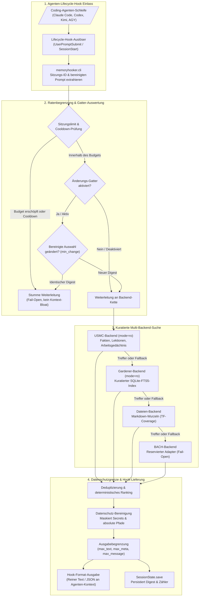
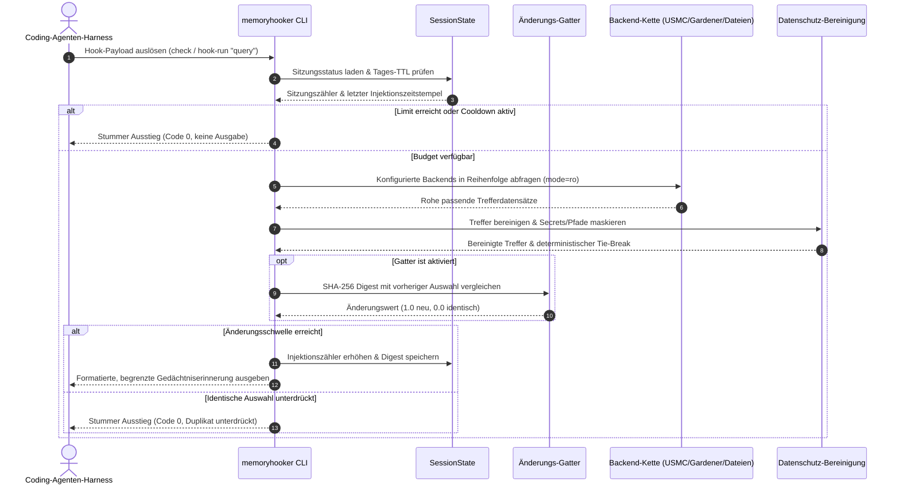

# MemoryHooker

[](https://github.com/ellmos-ai/memoryhooker/actions/workflows/ci.yml)
[](pyproject.toml)
[](pyproject.toml)
[](pyproject.toml)
[](LICENSE)
[](#sec-12)
[](#sec-12)
[](NOTICE)
[](THIRD_PARTY_LICENSES.txt)
[](SECURITY.md)
[](SECURITY.md)
[](SECURITY.md)
[](https://github.com/astral-sh/ruff)
[](https://github.com/ellmos-ai)
[](https://github.com/open-bricks)
[](llms.txt)
[](THIRD_PARTY_LICENSES.md)
[](MARKETING-LOG.txt)

[English](README.md) | [Deutsch](README_de.md)

> [!NOTE]
> **KI- & Agenten-Indexierung:** Dieses Repository bietet eine maschinenlesbare [`llms.txt`](llms.txt)-Zusammenfassung für KI-Agenten, LLM-Werkzeuge und Lifecycle-Hooks.
> **Beitragen:** Die Entwicklung findet im privaten Twin `memoryhooker-provenance` statt; dieses Repository trägt die kuratierte Open-Source-Distribution. Siehe [CONTRIBUTING.md](CONTRIBUTING.md).

MemoryHooker verbindet lokale Wissensquellen (Markdown-Verzeichnisse, SQLite-FTS5-Volltextdatenbanken und USMC-kuratierte Tabellen) mit den Lebenszyklus-Hooks von Coding-Agenten. Das Paket kann eine dezente Erinnerung an die Gedächtnissuche ausgeben, einen kurzen thematischen Hinweis liefern oder eine lokale Suche durchführen und ausgewählte, bereinigte Treffer direkt in den Prompt-Stream injizieren. Die Architektur operiert unter strikten Sicherheits- und Resilienz-Invarianten: sie erfordert kein Netzwerk, greift rein lesend auf externe Datenbanken zu, maskiert sensible Token, begrenzt die Ausgabelänge deterministisch und verändert niemals selbstständig die Host-Konfiguration.

---

<a id="sec-00"></a><a id="quick-navigation"></a><a id="schnellnavigation"></a>
## Schnellnavigation

- [✨ Highlights & Philosophie](#highlights--philosophie)
- [🏗️ Systemarchitektur & Visuelle Topologie](#systemarchitektur--visuelle-topologie)
- [🔄 End-to-End Lebenszyklus-Sequenz](#end-to-end-lebenszyklus-sequenz)
- [🎯 Zielgruppen & Auffindbarkeit](#zielgruppen--auffindbarkeit)
- [⚖️ Vergleichsmatrix gegenüber Alternativen](#vergleichsmatrix-gegenüber-alternativen)
- [🧠 Speicher-Backends & Ranking](#speicher-backends--ranking)
- [🛡️ Governance- & Laufzeit-Invarianten](#governance---laufzeit-invarianten)
- [🎛️ Betriebsmodi & Konfiguration](#betriebsmodi--konfiguration)
- [🔌 Unterstützte Provider & Snippets](#unterstützte-provider--snippets)
- [🔒 Datenschutz, Redigierung & Änderungs-Gatter](#datenschutz-redigierung--änderungs-gatter)
- [💻 Kommandozeile & Diagnose](#kommandozeile--diagnose)
- [🧪 Verifikation & Test-Suite](#verifikation--test-suite)
- [🌐 Geschwister-Ökosystem & Partnermatrix](#geschwister-ökosystem--partnermatrix)
- [📄 Drittanbieter-Lizenzen & Level 1 SBOM](#drittanbieter-lizenzen--level-1-sbom)
- [🔐 Sicherheitsrichtlinie & 48h-SLA](#sicherheitsrichtlinie--48h-sla)
- [📖 Maschinenlesbarer Kontext & llms.txt](#maschinenlesbarer-kontext--llmstxt)
- [🏛️ Autor, Attribution & Kanonische Notice](#autor-attribution--kanonische-notice)
- [📜 Gesetzlicher Haftungsausschluss (§ 521 BGB) & Lizenz](#gesetzlicher-haftungsausschluss--521-bgb--lizenz)

---

<a id="sec-01"></a><a id="highlights--philosophy"></a><a id="highlights--philosophie"></a>
## Highlights & Philosophie

- 🧠 **Mehrstufiges lokales Gedächtnis**: Fragt kuratierte USMC-Tabellen (`usmc_facts`, `usmc_lessons`, `usmc_working`), Gardener-SQLite-FTS5-Datenbanken oder lokale Markdown-Dateibäume mit konfigurierbaren Fallback-Ketten ab.
- 🛡️ **100% Zero-Egress Core**: Vollständig auf der Python-Standardbibliothek aufgebaut, ohne externe Runtime-Abhängigkeiten, ohne HTTP/TCP-Sockets und im unprivilegierten Anwendermodus (`RunAsInvoker`).
- 🔒 **Deterministische Datenschutzgrenze**: Redigiert API-Schlüssel, Bearer-Token, Passwörter und absolute Host-Dateipfade automatisch zu `[redacted]`, bevor Hook-Ausgaben emittiert werden.
- 🎛️ **Intelligente Ratenbegrenzung & Cooldown**: Schützt Agenten-Kontexte vor Flutung durch Begrenzung je Sitzung (`max_injections_per_session`), Cooldown-Intervalle und automatischen Tages-TTL-Reset.
- 🚪 **Optionales SHA-256 Änderungs-Gatter**: Vergleicht Auswahldigests mit früheren Emissionen; unterdrückt identische Treffer (`min_change = 1.0`), während nur Hashes persistiert werden—niemals rohe Prompts.
- 🔍 **Reine Lese-Diagnose**: Spezieller `diagnose`-Befehl analysiert Konfigurationsstatus, Ratenbegrenzung und Trefferwerte, ohne den Sitzungsstatus zu mutieren oder Quoten zu verbrauchen.
- 🤝 **Breites Ökosystem für Coding-Agenten**: Direkte Snippet-Generatoren für Claude Code, Codex CLI, Kimi Code CLI, Antigravity, Git und manuelle Pipelines.

---

<a id="sec-02"></a><a id="system-architecture--visual-topology"></a><a id="systemarchitektur--visuelle-topologie"></a>
## Systemarchitektur & Visuelle Topologie

### Vier-Ansichten-Architekturprojektion

```text
+-------------------------------------------------------------------------------+
|  SICHT 1: AUFRUFER-LAUFZEITEN, LIFECYCLE-HOOKS & AGENTEN-CLIENTS              |
|  - Coding-Agenten-Schleifen (Claude Code, Codex CLI, Kimi Code, Antigravity)  |
|  - Lifecycle-Hook-Auslöser (UserPromptSubmit, SessionStart, PreToolUse)       |
|  - Entwickler-Terminal-CLI (memoryhooker check / diagnose / clear / providers)|
|  - Automatisierte CI/CD-Quality-Gates & Multi-OS Test-Runner                  |
+---------------------------------------+---------------------------------------+
                                        | löst Hook-Payload / Anfrage aus
                                        v
+-------------------------------------------------------------------------------+
|  SICHT 2: MEMORYHOOKER SOUVERÄNE CORE-ENGINE & PIPELINE-ORCHESTRIERUNG        |
|  - Modus-Selektor (remember, clue, remember+search, Trigger-Injektor)         |
|  - Ingress-Schutzschranken (Sitzungsbudget, Cooldown, Kalendertag-TTL)        |
|  - Kryptografisches Änderungs-Gatter (SHA-256 Digest-Unterdrückung, 1.0)      |
|  - Multi-Backend-Dispatcher (USMC, Gardener SQLite FTS5, Files, BACH)         |
+---------------------------------------+---------------------------------------+
                                           | fragt ab / bewertet & filtert
                                           v
+-------------------------------------------------------------------------------+
|  SICHT 3: LAUFZEIT-PERSISTENZ, GETEILTE SPEICHER-SCHEMATA & AUDIT-LEDGER      |
|  - USMC kuratierte Tabellen (mode=ro: usmc_facts, usmc_lessons, usmc_working) |
|  - Gardener FTS5 Volltextindex (mode=ro: destillierte Lektionen, Filterung)   |
|  - Lokale Markdown-Dokumentwurzeln (normalisierte TF-Coverage-Sättigung)      |
|  - Geteilte Trigger-Invarianten (context_triggers: Regelgruppen & Präfixe)    |
+---------------------------------------+---------------------------------------+
                                        | bereinigt / begrenzt & emittiert
                                        v
+-------------------------------------------------------------------------------+
|  SICHT 4: AIR-GAP DEFENSE PERIMETER, RUNASINVOKER & ZERO-EGRESS-GOVERNANCE     |
|  - 100% Lokale Offline-Ausführung & Null Netzwerk-Sockets (INV-LOCAL-01)      |
|  - Unprivilegierte Non-Elevation-Sicherheitsrichtlinie (INV-UNPRIV-03)        |
|  - Deterministische Datenschutz-Bereinigung (INV-REDACT-04: maskiert Pfade)  |
|  - Fail-Open Fehlertoleranz (INV-FAILOPEN-08) & Ausgabebegrenzung (BOUND-05)  |
|  - Level-1-SBOM-Transparenz & Gesetzlicher Hinweis (§ 521 BGB) & 48h SLA     |
+-------------------------------------------------------------------------------+
```

### Systemarchitektur-Ablauf


```mermaid
flowchart TD
    subgraph INTAKE ["1. Agenten-Lifecycle-Hook Einlass"]
        AG[/"Coding-Agenten-Schleife<br/>(Claude Code, Codex, Kimi, AGY)"/] --> EVT["Lifecycle-Hook-Auslöser<br/>(UserPromptSubmit / SessionStart)"]
        EVT --> EXTR["memoryhooker.cli<br/>Sitzungs-ID & bereinigten Prompt extrahieren"]
    end

    subgraph GATING ["2. Ratenbegrenzung & Gatter-Auswertung"]
        EXTR --> SESS{"Sitzungslimit &<br/>Cooldown-Prüfung"}
        SESS -->|Budget erschöpft oder Cooldown| SILENT["Stumme Weiterleitung<br/>(Fail-Open, kein Kontext-Bloat)"]
        SESS -->|Innerhalb des Budgets| GATE{"Änderungs-Gatter<br/>aktiviert?"}
        GATE -->|Nein / Deaktiviert| RETR["Weiterleitung an Backend-Kette"]
        GATE -->|Ja / Aktiv| CHK{"Bereinigte Auswahl<br/>geändert? (min_change)"}
        CHK -->|Identischer Digest| SILENT
        CHK -->|Neuer Digest| RETR
    end

    subgraph RETRIEVAL ["3. Kuratierte Multi-Backend-Suche"]
        RETR --> B1["USMC-Backend (mode=ro)<br/>Fakten, Lektionen, Arbeitsgedächtnis"]
        B1 -->|Treffer oder Fallback| B2["Gardener-Backend (mode=ro)<br/>Kuratierter SQLite-FTS5-Index"]
        B2 -->|Treffer oder Fallback| B3["Dateien-Backend<br/>Markdown-Wurzeln (TF-Coverage)"]
        B3 -->|Treffer oder Fallback| B4["BACH-Backend<br/>Reservierter Adapter (Fail-Open)"]
    end

    subgraph SANITIZE ["4. Datenschutzgrenze & Hook-Lieferung"]
        B1 & B2 & B3 & B4 --> DEDUP["Deduplizierung & deterministisches Ranking"]
        DEDUP --> REDACT["Datenschutz-Bereinigung<br/>Maskiert Secrets & absolute Pfade"]
        REDACT --> BOUND["Ausgabebegrenzung<br/>(max_text, max_meta, max_message)"]
        BOUND --> INJECT["Hook-Format-Ausgabe<br/>(Reiner Text / JSON an Agenten-Kontext)"]
        BOUND --> STATE["SessionState.save<br/>Persistiert Digest & Zähler"]
    end
```

---

<a id="sec-03"></a><a id="end-to-end-lifecycle-sequence"></a><a id="end-to-end-lebenszyklus-sequenz"></a>
## End-to-End Lebenszyklus-Sequenz


```mermaid
sequenceDiagram
    autonumber
    actor Agent as Coding-Agenten-Harness
    participant CLI as memoryhooker CLI
    participant State as SessionState
    participant Gate as Änderungs-Gatter
    participant Chain as Backend-Kette (USMC/Gardener/Dateien)
    participant Privacy as Datenschutz-Bereinigung

    Agent->>CLI: Hook-Payload auslösen (check / hook-run "query")
    CLI->>State: Sitzungsstatus laden & Tages-TTL prüfen
    State-->>CLI: Sitzungszähler & letzter Injektionszeitstempel
    alt Limit erreicht oder Cooldown aktiv
        CLI-->>Agent: Stummer Ausstieg (Code 0, keine Ausgabe)
    else Budget verfügbar
        CLI->>Chain: Konfigurierte Backends in Reihenfolge abfragen (mode=ro)
        Chain-->>CLI: Rohe passende Trefferdatensätze
        CLI->>Privacy: Treffer bereinigen & Secrets/Pfade maskieren
        Privacy-->>CLI: Bereinigte Treffer & deterministischer Tie-Break
        opt Gatter ist aktiviert
            CLI->>Gate: SHA-256 Digest mit vorheriger Auswahl vergleichen
            Gate-->>CLI: Änderungswert (1.0 neu, 0.0 identisch)
        end
        alt Änderungsschwelle erreicht
            CLI->>State: Injektionszähler erhöhen & Digest speichern
            CLI-->>Agent: Formatierte, begrenzte Gedächtniserinnerung ausgeben
        else Identische Auswahl unterdrückt
            CLI-->>Agent: Stummer Ausstieg (Code 0, Duplikat unterdrückt)
        end
    end
```

---

<a id="sec-04"></a><a id="target-personas--discoverability"></a><a id="zielgruppen--auffindbarkeit"></a>
## Zielgruppen & Auffindbarkeit

| Persona | Kernprofil & Tech-Stack | Architektonische Reibung & Pain Point | Lösung durch `memoryhooker` |
|:---|:---|:---|:---|
| **[PERSONA-01] Autonome Coding-Agenten & Harness-Entwickler** | Entwickler von Agenten-Harnesses (Claude Code, Codex CLI, Kimi Code, Antigravity, eigene Loops). | Blinde Prompt-Ausführung ohne historische Projekt-Lektionen; unbegrenztes Context-Stuffing führt zu Latenz und massivem Token-Verbrauch. | Lifecycle-Hooks liefern maßgeschneiderte Erinnerungen (`remember`, `clue`, `remember+search`) mit strikten Obergrenzen und Fail-Open-Resilienz. |
| **[PERSONA-02] Local-First & Zero-Egress Systemarchitekten** | Verwaltung sicherer, lokaler oder isolierter Air-Gapped-Umgebungen. | Cloud-Vektordatenbanken (Pinecone, Qdrant Cloud) leiten proprietären Code aus, benötigen Anmeldedaten und erzeugen Netzwerk-Fehlerquellen. | 100% Zero-Egress Python-Standardbibliothek, null externe Sockets, lokale SQLite `mode=ro` Abfragen und unprivilegierte Ausführung (`RunAsInvoker`). |
| **[PERSONA-03] Multi-Agenten-Schwarm-Orchestratoren & Kontext-Ingenieure** | Entwurf kollaborativer Multi-Agenten-Architekturen (BACH, USMC, Schwärme). | Konkurrierende Schreibzugriffe beschädigen den Zustand; verrauschte Sitzungsprotokolle überdecken kuratierte Architektur-Leitlinien. | Lese-Adapter für kuratierte USMC/Gardener-Datenbanken, Protokoll-Rauschfilterung und deterministische Multi-Quellen-Deduplizierung. |
| **[PERSONA-04] Compliance-, Sicherheits- & Enterprise-DevOps-Beauftragte** | Regulierung unternehmensweiter KI-Sicherheitsgrenzen und Schutz vor Datenabfluss. | Prompts und Protokolle exponieren versehentlich API-Schlüssel, interne Pfade oder unkontrolliertes Zustands-Wachstum auf Entwicklergeräten. | Deterministische Regex-Redigierung sensibler Token und Pfade, feste Ausgabegrenzen, täglicher Zustands-Reset und transparente Prüfprotokolle. |

**High-Intent Suchbegriffe & Themen-Tags:** `coding-agent-memory-hook`, `local-first-memory-retrieval`, `llm-agent-hook-reminders`, `claude-code-memory-integration`, `codex-hook-memory`, `zero-egress-ai-memory`, `sqlite-fts5-agent-memory`, `deterministic-context-injection`, `privacy-safe-llm-hook`, `usmc-memory-backend`.

---

<a id="sec-05"></a><a id="comparative-matrix-vs-alternatives"></a><a id="vergleichsmatrix-gegenüber-alternativen"></a>
## Vergleichsmatrix gegenüber Alternativen

| Architektonisches Kriterium | Invarianten-Referenz | `memoryhooker` | Ad-hoc-Skripte | Cloud Vector DB RAG | Chat History Buffer | MemGPT / Letta |
|:---|:---|:---|:---|:---|:---|:---|
| **Lizenz & Open Source** | Open Source | **MIT (100% Frei)** | Unlizenziert | Kommerzielles SaaS | Integriert / Keine | Apache 2.0 / SaaS |
| **Netzwerk-Egress & Datenschutz**| `INV-LOCAL-01` | **100% Zero-Egress (0 Sockets)**| Variabel | Cloud Vector DB RAG | Lokaler Speicher | Remote-Server / Cloud |
| **Speicher-Mutierbarkeit** | `INV-READONLY-02` | **Strikter Lesezugriff (`mode=ro`)**| Unkontrolliert | Verwaltete Cloud | Flüchtiger Prompt | Schreib-/Lese-SQLite |
| **Sicherheit & Privilegien** | `INV-UNPRIV-03` | **Unprivilegiert (`RunAsInvoker`)**| Unkontrolliert | API-Token-Risiko | Unbehandelt | Server / Daemon |
| **Deterministische Redigierung** | `INV-REDACT-04` | **Ja (Token/Pfade -> `[redacted]`)**| Keine | Keine | Keine | Keine |
| **Ausgabelängen-Obergrenzen** | `INV-BOUND-05` | **Konfigurierbare Grenzen** | Keine | Rohe Payload | Kontext-Limit | Komplexe Pagination |
| **Deterministisches Änderungs-Gatter**| `INV-GATE-06` | **Ja (SHA-256 Unterdrückung)** | Keine | Keine | Keine | LLM-Eigenverwaltung |
| **Sitzungsbegrenzung & Rate-Limit**| `INV-SPAM-07` | **Ja (Limits, Cooldown, TTL)**| Keine | Kostenlimits | Fenster-Abschneidung| Daemon-Ratenbegrenzung|
| **Fehlertoleranz & Sicherheit** | `INV-FAILOPEN-08` | **Fail-Open (Kein Turn-Absturz)**| Fatale Fehler | Netzwerkfehler | Kontextverlust | Daemon-Absturz |
| **Verbindliche Sicherheits-SLA**| `INV-SLA-10` | **Verbindliche 48h-SLA** | Keine | Kommerziell | Keine | Community Best Effort |

---

<a id="sec-06"></a><a id="memory-backends--ranking"></a><a id="speicher-backends--ranking"></a>
## Speicher-Backends & Ranking

MemoryHooker verbindet sich mit mehreren in `memoryhooker.toml` konfigurierten Retrieval-Backends:

### 1. USMC-Backend (`usmc`)
Das `usmc`-Backend liest die drei kuratierten Tabellen von [USMC](https://pypi.org/project/usmc/) direkt im Nur-Lese-Modus (`mode=ro`): `usmc_facts`, `usmc_lessons` und `usmc_working`. Es importiert das `usmc`-Paket niemals direkt (wodurch eine automatische Schema-Initialisierung bei fehlenden Pfaden verhindert wird). Das Ranking gewichtet die Abdeckung distinkter Suchbegriffe mit der Kuratierungs-Dringlichkeit (z. B. überwiegen `critical`-Lektionen gegenüber `low`-Lektionen bei identischer Begriffstreffermenge).

### 2. Gardener-Backend (`gardener`)
Fragt lokale SQLite-Datenbanken ab, die mit FTS5-Volltextindizes ausgestattet sind. Um Kontext-Aufblähung zu vermeiden, filtert der Adapter unkuratierte Rohtranskripte (wie beobachtete Chatverläufe) automatisch heraus und konzentriert sich ausschließlich auf destillierte Gedächtnisinhalte und Lektionen.

### 3. Dateien-Backend (`files`)
Durchsucht konfigurierte Markdown-Verzeichnisse und einzelne Dateipfade. Verwendet eine normalisierte Ranking-Formel, die Begriffabdeckung (60%) und begrenzte Termfrequenz-Sättigung (40%) in `(0, 1]` kombiniert, inklusive Multi-Wurzel-Deduplizierung.

### 4. BACH-Backend (`bach`)
Ein reservierter Adapter für zukünftige BACH-Ökosystem-Integrationen. Reagiert aktuell fail-open und liefert ohne Datenbankzugriff sauber 0 Treffer.

---

<a id="sec-07"></a><a id="governance--runtime-invariants"></a><a id="governance---laufzeit-invarianten"></a>
## Governance- & Laufzeit-Invarianten

| Invarianten-ID | Name / Schutzbereich | Durchsetzungs-Ebene & Mechanismus | Architektonische Garantie & Fehlerverhalten |
|:---|:---|:---|:---|
| `INV-LOCAL-01` | **100% Local-First & Zero-Egress** | Architektonisch / Null Netzwerk-Sockets | Die Kern-Engine importiert keine Netzwerkbibliotheken und führt keine HTTP/TCP/UDP-Operationen aus. Gedächtnisabfragen verlassen niemals die lokale Maschine. |
| `INV-READONLY-02` | **Reiner Lesezugriff auf Speicher** | Datenbank-Verbindungsvertrag (`mode=ro`) | Externe SQLite-Datenbanken (Gardener, USMC) werden strikt schreibgeschützt geöffnet; MemoryHooker erzeugt niemals Schemas oder mutiert Fremddaten. |
| `INV-UNPRIV-03` | **Unprivilegierter Anwendermodus (RunAsInvoker)** | Prozess-Sicherheitsmodell | Läuft vollständig unter Standard-Benutzerrechten ohne Anforderung administrativer Elevation, wodurch das Least-Privilege-Prinzip gewahrt bleibt. |
| `INV-REDACT-04` | **Deterministische Redigierung von Secrets/Pfaden** | Regex-Sanitizer (`memoryhooker.policy`) | Redigiert gängige API-Schlüssel, Passwörter, Bearer-Token und absolute lokale Dateisystempfade automatisch zu `[redacted]` vor jeder Hook-Ausgabe. |
| `INV-BOUND-05` | **Strikte Begrenzung von Feldern und Nachrichten** | Ausgabe-Schutzgrenze | Erzwingt konfigurierbare Höchstgrenzen für Textlängen, Quellpfade, Metadaten-Einträge und die Gesamtnachrichtenlänge (`max_message_chars`). |
| `INV-GATE-06` | **Deterministisches Änderungs-Gatter** | Kryptografischer Digest-Vergleich | Berechnet den SHA-256-Digest bereinigter Auswahlen; unterdrückt identische wiederholte Treffer (`min_change = 1.0`), während nur Hashes persistiert werden. |
| `INV-SPAM-07` | **Sitzungs-Ratenbegrenzung & Tages-TTL** | SessionState-Controller | Erzwingt `max_injections_per_session` und `cooldown_seconds`. Der Sitzungsstatus setzt sich über Kalendertage automatisch zurück (`state_date`). |
| `INV-FAILOPEN-08` | **Fail-Open Fehlertoleranz für Hooks** | Ausnahme-Isolationsgrenzen | Fehlende Konfigurationen, nicht erreichbare Backends oder defekte Statusdateien enden sauber mit Statuscode 0 ohne Ausgabe und bringen Agenten nie zum Absturz. |
| `INV-LLM-09` | **Bilinguale Parität & LLM-Indexierung** | Dokumentations-Architektur | Vollständige 18-Punkte-Anker-Parität zwischen Englisch (`README.md`) und Deutsch (`README_de.md`), gepaart mit strukturiertem [`llms.txt`](llms.txt). |
| `INV-SLA-10` | **48-Stunden Antwort- & 5-Tage Triage-SLA** | Sicherheitsrichtlinie (`SECURITY.md`) | Dedizierte Sicherheitskanäle (`security@ellmos.ai`, `security@open-bricks.org`) mit verbindlicher 48-Stunden-Erstprüfungs- und 5-Tage-Triage-Zusage. |

---

<a id="sec-08"></a><a id="modes--configuration"></a><a id="betriebsmodi--konfiguration"></a>
## Betriebsmodi & Konfiguration

Erstellen Sie `memoryhooker.toml` im Projekt- oder Benutzer-Stammverzeichnis:

```toml
[mode]
active = "remember+search"
search_after_n_searches = 3
max_hits = 3
min_rank = 0.5
max_injections_per_session = 5
cooldown_seconds = 60

[gate]
# Explizite Aktivierung. Wenn false (Standard), gilt das Standard-Modusverhalten.
enabled = false
min_relevance = 0.5
# 1.0 unterdrückt eine identische bereinigte Auswahl im Vergleich zur letzten Emission.
min_change = 1.0

[output]
max_text_chars = 500
max_source_chars = 160
max_meta_chars = 160
max_meta_entries = 32
max_meta_total_chars = 1000
max_message_chars = 2000
redaction_marker = "[redacted]"
truncation_marker = "…[truncated]"

[backend]
order = ["usmc", "gardener", "files"]

[backend.usmc]
db_path = "~/.usmc/usmc_memory.db"

[backend.gardener]
db_path = "~/.gardener/gardener.db"
user_db_path = "~/.gardener/user.db"

[backend.files]
path = "./memory"

[providers]
order = ["claude", "codex", "kimi", "agy", "git", "manual"]
```

### Betriebsmodi
- **`remember`**: Leichtgewichtige Erinnerung, die den Agenten bei Überschreiten von Intervallschwellen an die Gedächtnissuche erinnert.
- **`clue`**: Liefert einen gezielten thematischen Hinweis, sobald Prompt-Begriffe mit konfigurierten Auslösern übereinstimmen.
- **`remember+search`**: Führt eine lokale Suche über die Backends aus und formatiert die am besten bewerteten Treffer direkt in die Hook-Ausgabe.

### Trigger-Injektor (optional, standardmäßig deaktiviert)
Unabhängig vom aktiven Modus emittiert `[triggers]` kuratierte Schlagwort-Hinweise aus der gemeinsamen Tabelle `context_triggers` (`memory_union`-Vertrag, gelesen vom `usmc`-Backend und vom in-process BACH-Backend). Jede Quelle liefert maximal einen Hinweis pro Prompt (erster passender Datensatz nach `id`) und verfügt über einen eigenen Cooldown; `trigger_phrase` kann Alternativen getrennt durch `|` enthalten.

```toml
[triggers]
sources = ["strategy"]   # context_triggers.source-Werte; leer = aus
agent_id = "default"     # Zeilen dieses Agenten plus 'default'
once_per_session = []    # z. B. ["theme"]: eine Regel dieser Quellen feuert einmal pro Sitzung
[triggers.cooldowns]
strategy = 120           # Sekunden; Standard 60
[triggers.groups]        # optional: ein Injektor-Schlüssel über mehrere Tabellenquellen
context = ["manual", "theme", "workflow"]   # ein Hinweis pro Prompt, erster Treffer nach id
[triggers.prefixes]
context = "[KONTEXT] "
```

---

<a id="sec-09"></a><a id="supported-providers--snippets"></a><a id="unterstützte-provider--snippets"></a>
## Unterstützte Provider & Snippets

MemoryHooker erzeugt Konfigurationsfragmente passend für die Lifecycle-Hooks des Host-Agenten:

```shell
# Verfügbare Provider prüfen
python -m memoryhooker providers

# Konfigurations-Snippet für spezifischen Coding-Agenten generieren
python -m memoryhooker install-snippet --provider claude
python -m memoryhooker install-snippet --provider codex
python -m memoryhooker install-snippet --provider kimi
python -m memoryhooker install-snippet --provider agy
```

> [!IMPORTANT]
> `install-snippet` druckt das exakte Hook-Konfigurationsfragment auf stdout. Gemäß `INV-UNPRIV-03` und Sicherheitsprinzipien modifiziert es Host-Konfigurationsdateien niemals automatisch. Überprüfen und integrieren Sie das Fragment manuell in Ihre Agenten-Einstellungen.

---

<a id="sec-10"></a><a id="privacy-redaction--change-gates"></a><a id="datenschutz-redigierung--änderungs-gatter"></a>
## Datenschutz, Redigierung & Änderungs-Gatter

MemoryHooker behandelt Prompt-Inhalte und abgerufene Datensätze mit defensiver Datenisolation:

1. **Deterministische Redigierung**: Bevor eine Hook-Ausgabe erfolgt, durchlaufen Zeichenketten Regex-Filter, die Anmeldedaten (API-Schlüssel, Passwörter, Bearer-Token) und absolute Host-Pfade durch `[redacted]` ersetzen.
2. **Deterministischer Tie-Break**: Gleichrangige Treffer werden nach Quellenschlüssel und Texthash sortiert, was absolute Reproduzierbarkeit über alle Ausführungsläufe sicherstellt.
3. **Kryptografisches Änderungs-Gatter (`[gate]`)**: Wenn aktiviert, berechnet es einen SHA-256-Digest über die bereinigte Trefferauswahl. Stimmt der Digest mit der vorherigen Ausgabe im Sitzungsstatus überein, bleibt der Hook stumm und verhindert doppelte Erinnerungen.

---

<a id="sec-11"></a><a id="command-line--diagnostics"></a><a id="kommandozeile--diagnose"></a>
## Kommandozeile & Diagnose

```shell
# Standardmäßige Hook-Prüfung
python -m memoryhooker --config memoryhooker.toml check "deployment checklist"

# Reine Lese-Diagnose (analysiert Konfiguration, Gatter und Trefferränge ohne Statusmutation)
python -m memoryhooker --config memoryhooker.toml diagnose "deployment checklist"

# Sitzungsinjektions-Budget zurücksetzen
python -m memoryhooker clear
```

### Fehlerbehebung: Der stumme Hook
Konzeptbedingt beenden sich `check` und `hook-run` stumm mit Code 0, wenn keine relevanten Treffer vorliegen oder Grenzwerte greifen—ein Hook darf niemals wie ein Fehler des Agenten wirken. Wenn Ihr Hook unerwartet stumm bleibt:
- Stellen Sie sicher, dass `--config`, `--session-id` und `--state-dir` als **Top-Level-Argumente vor** dem Unterbefehl übergeben werden (z. B. `memoryhooker --config x.toml check "..."`).
- Führen Sie `diagnose` mit dem identischen Prompt und den gleichen Flags aus, um zu sehen, ob Konfigurationsladung, Ratenbegrenzung oder Backend-Verfügbarkeit das Schweigen verursachten.

---

<a id="sec-12"></a><a id="verification--test-suite"></a><a id="verifikation--test-suite"></a>
## Verifikation & Test-Suite

```powershell
# Vollständige automatisierte Test-Suite ausführen
python -m pytest

# Code-Stil & statische Analyse ausführen
python -m ruff check .

# Bytecode-Kompilierung verifizieren
python -m compileall -q memoryhooker tests
```

Über 213 automatisierte Unit-, Integrations-, Verhaltens- und Vertragstests validieren inkrementelles Retrieval, FTS5-Abfragen, USMC-Tabellenkuratierung, deterministische Redigierung, Sitzungsbegrenzung und Manifest-Parität mit 100% grünem Status.

---

<a id="sec-13"></a><a id="sibling-ecosystem--partner-matrix"></a><a id="geschwister-ökosystem--partnermatrix"></a>
## Geschwister-Ökosystem & Partnermatrix

MemoryHooker ist eine Kernkomponente des `ellmos-ai`-Ökosystems unter dem Open-Source-Dach von `open-bricks`:

| Komponente / Schicht | Modul / Werkzeug | Rolle im Ökosystem |
|:---|:---|:---|
| **Gedächtnis & Kuratiertes Wissen** | `usmc` | Universal Semantic Memory Core (kuratierte Fakten, Lektionen, Arbeitsgedächtnis) |
| **Indexierung & Beobachtung** | `gardener` | Inkrementelle Dateiindexierung, Wissenskonsolidierung und SQLite-Textsuche |
| **Lifecycle-Hooks & Orchestrierung**| `workflowhooker` | Deklarative Workflow-Hooks und Orchestrierungs-Auslöser für Agenten-Pipelines |
| **Kern- & Grundsatz-Protokolle** | `ellmos-core` | Kern-Fähigkeitsdeskriptoren, Modulverträge und grundlegende Abstraktionen |
| **Multi-Agenten-Zustandssicherung** | `clutch`, `coma` | Agenten-Zustandssicherung, Ausführungs-Snapshots und Kontext-Kompaktierung |
| **Planung & Ausführung** | `ellmos-scheduler` | Lokaler Cron-, Intervall- und autoritätsgepachteter Hintergrund-Job-Runner |
| **Steuerung & Governance** | `ellmos-controlcenter-mcp` | Fähigkeits-Routing, Stack-Erkennung und Werkzeug-Mediation |
| **Code-Intelligenz** | `ellmos-codecommander-mcp` | Strukturelle Code-Manipulation, Import-Diagnostik und AST-Analyse |
| **Dateisystem-Triage** | `ellmos-filecommander-mcp` | Sichere Dateisystem-Operationen, Prüfsummen und Dateiverwaltung |
| **Datei-Automatisierung** | `file-collect-sort-action` | Konfigurationsgesteuerte Ordnerabtastung, Deduplizierung und Aktionen |
| **Workflow-Automatisierung** | `n8n-manager-mcp` | Workflow-Lebenszyklus-Automatisierung, Sicherheits-Governance und APIs |
| **Lock-Governance** | `lock-master` | Zentrale Lock-Verwaltung, Konfliktvermeidung und Multi-Agenten-Koordination |
| **Vorfall- & Ticket-Verfolgung** | `ticket-master` | Lokale Fehlertriage, Ticket-Lebenszyklus-Management und Quittungen |
| **Agenten-Bootstrap** | `safe-start-for-codex` | Deterministische Laufzeit-Initialisierung, Rechte-Gatter, Lock-Prüfungen |
| **Entwickler-Arbeitsbereiche** | `DevCenter`, `CodeBox` | Interaktive Arbeitsbereiche, Pipeline-Überwachung und UI-Oberflächen |
| **Dach-Ökosystem** | `open-bricks` | Open-Source-Standardbibliotheken, Werkzeugsammlungen und Desktop-Apps |

---

<a id="sec-14"></a><a id="third-party-licenses--level-1-sbom"></a><a id="drittanbieter-lizenzen--level-1-sbom"></a>
## Drittanbieter-Lizenzen & Level 1 SBOM

MemoryHooker führt ein geprüftes Inventar aller Laufzeitkomponenten und Entwicklerwerkzeuge in [`THIRD_PARTY_LICENSES.md`](THIRD_PARTY_LICENSES.md) (reine Textbegleitdatei: [`THIRD_PARTY_LICENSES.txt`](THIRD_PARTY_LICENSES.txt)) sowie die kanonische Attribution in [`NOTICE`](NOTICE). Der gesamte Laufzeitcode basiert auf permissiven Komponenten (MIT und PSFL-2.0), Entwicklungsabhängigkeiten stehen unter MIT und Apache-2.0. Es existieren **keine Copyleft-Abhängigkeiten**. Zielgruppen, Suchbegriffe und Konkurrenzanalysen werden in [`MARKETING-LOG.txt`](MARKETING-LOG.txt) gepflegt.

---

<a id="sec-15"></a><a id="security-policy--48h-sla"></a><a id="sicherheitsrichtlinie--48h-sla"></a>
## Sicherheitsrichtlinie & 48h-SLA

MemoryHooker verfolgt eine strikte Richtlinie zur Offenlegung von Sicherheitslücken in [`SECURITY.md`](SECURITY.md). Wir verpflichten uns zu einer **48-Stunden-Reaktions-SLA** und einem **5-Werktage-Triage-Fenster** für vertrauliche Sicherheitsmeldungen über GitHub Security Advisories oder an `security@ellmos.ai` und `security@open-bricks.org`.

---

<a id="sec-16"></a><a id="machine-readable-context--llmstxt"></a><a id="maschinenlesbarer-kontext--llmstxt"></a>
## Maschinenlesbarer Kontext & llms.txt

Dieses Repository stellt eine maschinenlesbare Kontextdatei unter [`llms.txt`](llms.txt) gemäß gängigen Agenten-Indexierungsspezifikationen bereit. Sie exponiert zentrale Invarianten, Provider-Schnittstellen und Dateikarten zur direkten Verarbeitung durch autonome Agenten und LLM-Harnesses.

---

<a id="sec-17"></a><a id="author-attribution--canonical-notice"></a><a id="autor-attribution--kanonische-notice"></a>
## Autor, Attribution & Kanonische Notice

MemoryHooker wird von **Lukas Geiger** und Mitwirkenden als Teil der Organisation **ellmos-ai** unter dem Dach der Open-Source-Initiative **open-bricks** entwickelt und gepflegt. Detaillierte Provenienz-Erklärungen, architektonische Abstammung und Copyright-Ansprüche sind in [`NOTICE`](NOTICE) und [`PROVENANCE.md`](PROVENANCE.md) dokumentiert.

---

<a id="sec-18"></a><a id="statutory-disclaimer--521-bgb--license"></a><a id="gesetzlicher-haftungsausschluss--521-bgb--lizenz"></a>
## Gesetzlicher Haftungsausschluss (§ 521 BGB) & Lizenz

Diese Software wird unentgeltlich unter den Bedingungen der [MIT License](LICENSE) zur Verfügung gestellt. Gemäß den gesetzlichen Bestimmungen des deutschen Schenkungs- und Gefälligkeitsrechts (§ 521 BGB) ist die Haftung für Sach- und Rechtsmängel auf Vorsatz und arglistiges Verschweigen beschränkt. Die Bereitstellung erfolgt ohne ausdrückliche oder stillschweigende Gewährleistung jeglicher Art.
